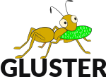

class: center, middle
background-image: url(images/feather.png)
# OSAS Projects Overview

Open Source and Standards

Red Hat

http://community.redhat.com/

---

 	The CentOS project is responsible for the production of CentOS, an enterprise-ready Linux distribution derived from the Red Hat Enterprise Linux codebase and other sources.
---

	Ceph is an open source and freely available distributed object store and file system that relies upon the RADOS (Reliable Autonomic Distributed Object Store) foundation.
---

	The Fedora Project is a free and open source software community project that produces a complete Linux-based operating system ready for cloud, server, or workstation.
---

	The Gluster Project community produces and releases GlusterFS, open source software used to create a scalable network file system for large and distributed storage solutions.
---

	Project Atomic advances the way containerized applications are created, deployed, and managed. Specifications, standards, and implementations contribute to the growing functionality and security of containers.
---

	RDO provides the open source foundation for your organization to build a private or public Infrastructure-as-a-Service (IaaS) cloud on top of enterprise-ready platforms like CentOS.

